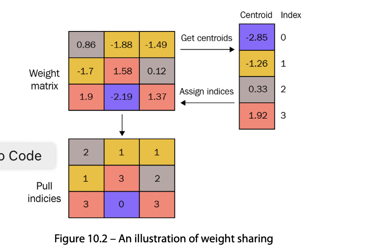

# Improving Inference Efficiency
当深度学习（DL）模型部署在边缘设备上时，推理效率通常是
不令人满意的；不满足的；不符合要求的这些问题主要来自于经过训练的网络的大小，因为它需要大量的计算。因此，当在边缘设备上部署DL模型时，许多工程师和科学家经常牺牲准确性来换取速度。此外，由于边缘设备的存储空间通常有限，他们专注于缩小型号大小。

会讲到几个概念
- network quantization
- weight sharing 
- network pruning
- knowledge distillation
- network architecture search

## Network quantization -- reducing the number of bits used for model parameters 
网络量化，也称为模型量化，是将模型与之交互的一系列数值重新映射到可以用更少比特表示的数字系统的过程
比如说，用位深度8代表32位。


不幸的是，网络量化涉及的不仅仅是从高精度转换数字
降低精度。这是因为DL模型推理涉及产生数字的算法其精度高于输入的精度。

模型量化可以分為兩個方面
- post-training quantization 训练后量化
- quantization-aware training 量化意识训练

### Performing post-training quantization
在PyTorch的情况下，有两种不同的训练后量化方法：**动态量化**和**静态量化**。它们因量化发生的时间而不同，并且具有不同的优点和缺点。在本节中，我们将提供每个算法的高级描述，以及代码示例
#### Dynamic quantization - quantizing the model at runtime 
這種算法提前对权重应用量化，而对激活的量化在推理期间动态发生。
通常在LSTM和transfomer上面使用。
```python
import torch
model = "" 
quantized_model = torch.quantization.quantize_dynamic(
    model,gconfig_spec =  {torch.nn.Linear},
    dtype=torch.int8
)

```

#### Static quantization - determining optimal quantization parameters using a representative dataset
另一种类型的量化称为静态量化。与TF的全整数量化一样，这种类型的量化通过使用代表性数据集估计模型与之交互的数字范围来最小化模型性能退化。

```python
import torch
class OriginalModel(torch.nn.Module):
    def __init__(self):
        super(M,self).__init__()
        # QuantStub converts the incoming floating point tensors into a quantized tensor
        self.quant = torch.quantization.QuantStub()
        self.linear = torch.nn.Linear(10,20)
        self.dequant = torch.quantization.DeQuantStub()
    
    def forwar(self,x):
        # using quanstub and dequanstub operations ,we can indicate the region for quantization
        x = self.quant(x)
        x = self.linear(x)
        x = self.dequant(x)
        return  x 
```
在前面的网络中，我们有一个线性层，但也有两个额外的操作
在__init__函数中初始化：torch.quantiation.QuantStub和torch.DeQuantStub。前一个运算应用于输入张量以指示
量化的开始。后一个操作被应用为前进中的最后一个操作
函数来指示量化的结束。下面的代码片段描述了第一步
静态量化的校准过程：

```python
# model is instantiated and trained 
model_fp32 = OriginalModel()

# prepare the model for static quantization
model_fp32.eval()
model_fp32.gconfig = torch.quantization.get_default_gconfig('fbgemm')
model_fp32_prepared = torch.quantization.prepare(model_fp32)

# determine the best quantization settings by calibrating the model on a representative dataset
calibration_dataset = ''
model_fp32_prepared.eval()
for data,label in calibration_dataset:
    model_fp32_prepared(data)
# 最後一步·
model_int8 = torch.quantization.convert(model_fp32_prepared)
```


### Performing quantization-aware training 
训练后量化可以显著减小模型大小。然而，它也可能显著降低模型的准确性。
因此，出现了以下问题：我们能否恢复一些丢失的准确性？这个问题的答案可能是**量化感知训练（QAT）**。在这种情况下，在训练之前对模型进行量化，以便它可以直接使用较低精度的权重和激活来学习泛化。


#### Quantization-aware training in PyTorch
The complete details can be found at https://pytorch.org/docs/stable/quantization.html#quantization-aware-training-for-staticquantization. 


QAT的设置几乎与我们在静态量化中进行的静态量化相同——使用代表性数据集部分确定最佳量化参数。对于静态量化和QAT这两者的模型，同样的修改是必要的；
```python
model_fp32 = OriginalModel()
# model must be set to train mode for QAT
model_fp32.train()
model_fp32.qconfig = torch.quantization.get_default_qat_qconfig('fbgemm')
model_fp32_prepared = torch.quantization.prepare_qat(model_fp32_fused)
# train the model
for data,label in train_dataset:
    pred = model_fp32_prapared(data)
# generate quantized version of the trained model 
model_fp32_prepared.eval()
model_int8 = torch.quantization.conver(model_fp32_prepared)
```

## Weight sharing -- reducing the number of distinct weight values 
权重共享或权重聚类是另一种可以显著减小模型大小的技术。


### Performing weight sharing in PyTorch
Unfortunately, PyTorch does not support weight sharing. Instead, we will provide a high-level description of a possible implementation. 

```python
from torch.nn import Module
class SampleModel(Module):
    def __init__(self):
        self.layer = '...'
        self.weights_cluster = .. # cluster index for each weight 
        self.weights_mapping = ...# mapping from a cluster index to a centroid value 

    def forward(self,input):
        if self.training:
            output = self.layer(input)
        else:
            # update weights of the self.layer by reassigning each value based on self.weights_cluster and self.weights_mapping 
            output = self.layer(input)
            return output 
    def cluster_weights(self):
        # cluster weights of the layer 
        # model
model = SampleModel()
# train model 
....
# perform weight sharing 
model.cluster_weights()
model.eval()
```


## Network pruning -eliminating unnecessary connections within the network 
网络修剪是一个优化过程，可以消除不必要的连接。该技术可以在训练后应用，但也可以在训练期间应用，在训练期间可以进一步减少模型精度的降低。
### Network pruning in PyTorch
PyTorch supports post-training network pruning through the torch.nn.utils.prune module. 
```python

# model is instantiated and trained 
model = ''
parameters_to_prune = (
    (model.conv,'weight'),
    (model.fc,'weight')
)
prune.global_unstructured(
    parameters_to_prune,
    pruning_method=prune.L1Unstructured, # L1-norm
    amount=0.2
)
```

## Knowledge distillation -- obtaining a smaller network by mimicking the prediction
> 知识提炼，知識蒸餾

The idea of knowledge distillation was first introduced in 2015 by Hinton et al. in their publication
titled Distilling the Knowledge in a Neural Network

在分類問題中，softmax通常認為是最後一步，但這個作者認為，其他置信度也是有用處的。

基于这一想法，作者提出了一种将训练模型的知识转移到较小规模模型的技术：知识提取。


自从这种技术首次出现以来，已经引入了许多变体。第一套
变异源于知识的定义方式：基于反应的知识（网络输出）、基于特征的知识（中间表示）和基于关系的知识
（层或数据样本之间的关系）。
另一组变化集中在如何
实现知识转移：离线提炼（从预先训练的学生模型中训练
教师模型）、在线提炼（在两个模型都经过训练时共享知识）和自我提炼（在单个网络中共享知识）。我们相信，如果你是这样的话，Gou等人写的一篇题为《知识提炼：一项调查》的论文可以成为一个很好的起点
愿意进一步探索这一领域。


## Network Architecture Search - finding the most efficient network architecture 
神经结构搜索（NAS）是为给定的问题找到层的最佳组织的过程。
