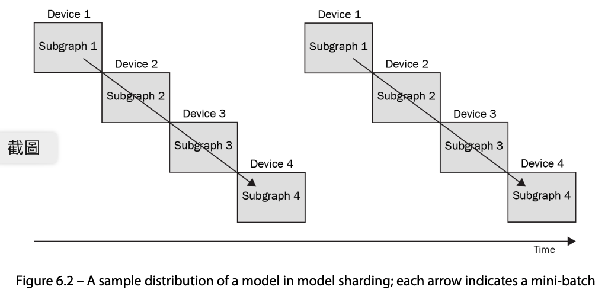
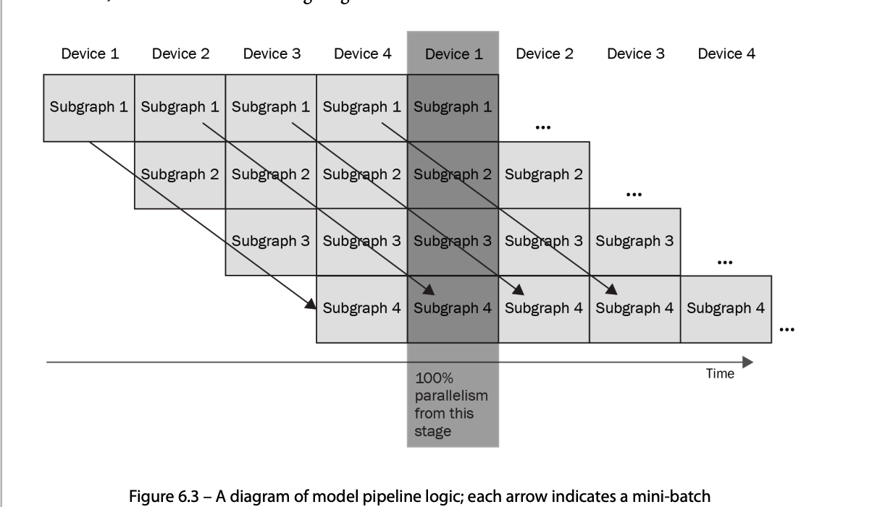

# Efficient Model Training 

## Training  a model on a cluster 
尽管在一台机器上使用多个GPU大大减少了训练时间，但有些型号非常庞大，仍然需要多天的训练。添加更多GPU仍然是一种选择
但物理限制往往存在，使您无法充分利用多GPU的潜力设置：主板可以支持有限数量的GPU设备。


幸运的是，许多DL框架已经支持在分布式系统上训练模型。
虽然在实际实现中存在微小的差异，但大多数框架都采用了**模型并行**和**数据并行**的思想。

### Model parallelism
在模型并行的情况下，分布式系统中的每台机器都承担模型的一部分，并管理分配组件的计算。

#### Model sharding 
模型分片只不过是将模型划分为多个设备上的多个计算子图。


让我们假设一个基本的单层深度神经网络（DNN）模型的简单场景（没有并行路径）。该模型可以划分为几个连续的子图，分片轮廓可以用图形表示如下。
数据将从具有第一个子图的设备开始按顺序流动。每个设备将计算出的值传递给下一个子图的设备。在必要的数据到达之前，设备将保持空闲


正如您所看到的，模型分片并没有充分利用计算资源；设备正在等待另一个设备来处理其子图。为了解决这个问题，提出了流水线方法。

#### Model pipelining 

然而，模型流水线需要向后传播的修改版本。让我们看看如何在模型流水线设置中实现单个正向和反向传播。
在某个时刻，每个设备不仅需要对子图进行正向计算，还需要进行梯度计算。单个正向和反向传播可以这样实现：

#### model parallelism in Pytorch 
模型并行性仅在PyTorch上可用，尚未在PL中实现,有很多方法可以使用PyTorch实现模型并行性，最标准的方法是使用
实现机器间通信的torch.distributed.rpc模块.使用远程过程调用（RPC）。基于RPC的方法的三个主要特征是
远程触发功能或网络（远程执行），访问和引用远程,数据对象（远程引用），并扩展PyTorch的梯度更新功能,跨越机器边界（分布式梯度更新）：https://pytorch.org/docs/stable/rpc.html.

### Data parallelism 
与模型并行不同，数据并行旨在通过将数据集分割为 集群中的机器。每台机器都会获得一份模型副本，并使用
它被分配到的数据集。然后，梯度被聚合，模型被更新同时在全球范围内。

#### Data parallelism in pytorch
**torch.nn.parallel.DistributedDataParallel(DDP)**
要使用数据并行性训练模型，需要修改训练代码以利用底层分布式系统，并在每台机器上使用torch.distributed.run模块生成一个进程

The following code snippet describes what you need to change for ddp. You simply need to provide
ddp for the `accelerator` parameter of Trainer. `num_nodes` is the parameter to adjust when
there is more than one machine in the cluster:

```python
# train on 8 gpus (same machine)
trainer = Trainer(gpus=8,accelerator='ddp')
# train on 32 gpus (4 nodes)
trainer = Trainer(gpus=8,accelerator='ddp',num_nodes=4)
```
请记住，MASTER_ADDR和MASTER_PORT在每个处理器用于通信时必须一致。另一方面，NODE_RANK表示机器的索引。换句话说，每台机器都必须不同，并且必须从零开始：
```powershell
python -m torch.distributed.run
    --nnodes=2 # number of nodes you'd like to run with
    --master_addr <MASTER_ADDR>
    --master_port <MASTER_PORT>
    --node_rank <NODE_RANK>
    train.py (--arg1 ... train script args...)
```

## Training  a model using SageMaker 
SageMaker旨在帮助工程师和研究人员专注于开发高质量的DL管道，而无需担心基础设施管理。

SageMaker为您管理数据存储和计算资源，使您能够以最小的工作量利用分布式系统进行模型训练。此外，SageMaker支持将数据流式传输到您的模型，用于推理、超参数调整以及跟踪实验和工件。
### Training a Pytorch model using SageMaker 
```python
import sagemaker
from sagemaker.pytorch import PyTorch
# Initializes SageMaker session
sagemaker_session = sagemaker.Session()
bucket = 's3://dataset/'
pytorch_estimator = PyTorch(
                      entry_point='train.py',
                      source_dir='.',
                      role=sagemaker.get_execution_role(),
                      framework_version='1.10.0',
                      train_instance_count=1,
                      train_instance_type='ml.c5.18xlarge',
                      hyperparameters={'epochs': 6})
…
pytorch_estimator.fit({
    'training': bucket+'/training',
    'validation': bucket+'/validation'})
```

### training a model in a distributed fashion using SageMaker 

```python
from sagemaker_tensorflow import PipeModeDataset
ds = PipeModeDataset(channel='training', record_format='TFRecord') 
```
### SageMaker with Horovod 
SageMaker分布式训练的另一个选择是使用Horovod，这是一个基于消息传递接口（MPI）原理的分布式DL训练的免费开源框架。
```python
distribution={"mpi": {"enabled":True, 
            "processes_per_host":2 }}
```


#### configuring a Pytorch training script for horovod
Unfortunately, PL does not have proper documentation for Horovod support yet. Therefore, we will
focus on PyTorch in this section. Similar to what we described in the preceding section, we will
demonstrate the code change you need to make for the PyTorch training script. For PyTorch, you
need the horovod.torch module, which we will refer to as hvd again. In the following code
snippet, we are importing the necessary modules and initializing the cluster:

```python
import torch
import horovod.torch as hvd 
hvd.init()
torch.cuda.set_device(hvd.local_rank())

```
训练脚本的其他部分需要进行类似的修改。数据集需要分布
使用torch.utils.data.distributed.DistributedSampler和
优化器必须围绕hvd进行包装。分布式优化器。主要区别
来自hvd.broadcast_parameters（model.state_dict（），root_rank=0），
其广播模型权重。您可以在以下代码片段中找到详细信息：
```python
# define dataset
train_dataset = "..."
# partition dataset among workers using DistributedSampler
train_sampler = torch.utils.data.distributed.DistributedSampler(
    train_dataset,num_replicas=hvd.size(),rank=hvd.rank()
)
train_loader = torch.utils.data.DataLoader(train_dataset,batch_size,sampler=trian_sampler)
# build model
model = '..'
model.cuda()
optimizer = optim.SGD(model.parameters())

# add horovod Distributed optimizer 
optimizer = hvd.DistributedOptimizer(optimizer, named_parameters=model.named_parameters())
# broadcast parameters from rank 0 to all other processess
hvd.broadcast_parameters(model.state_dict(), root_rank=0)
```
现在，您已经准备好训练模型了。训练循环不需要任何修改。你可以
只需将输入张量传递给模型，并通过触发反向传播来触发反向传播,.优化器的损失函数和阶跃函数。以下代码片段描述了
培训逻辑的主要部分：
```python
for epoch in range(num_epochs):
    for batch_idx,(data,target) in enumerate(train_loader):
        optimizer.zero_grad()
        output = model(data)
        loss = F.nll_loss(output,target)
        loss.backward()
        optimizer.step()
```
